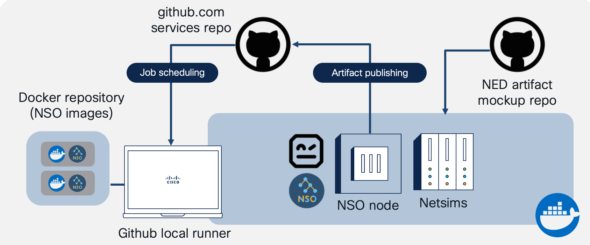
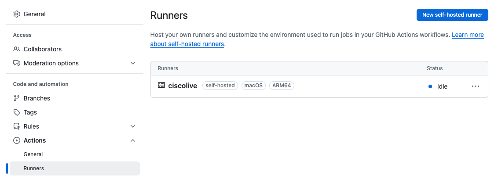
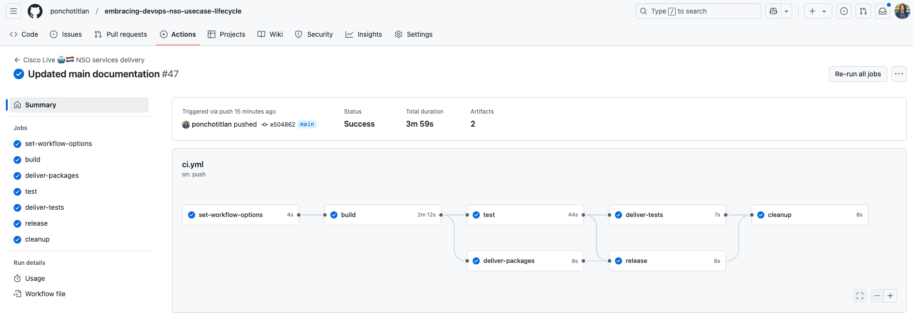

# [DEVNET-2224](https://www.ciscolive.com/emea/learn/session-catalog.html?search=devnet-2224&search=devnet-2224#/): Embracing DevOps for my NSO Use Cases lifecycle. Cisco Live EMEA 2025 🤖🇳🇱


[]()
[]()
[]()
[](https://www.ciscolive.com/emea/learn/session-catalog.html?search=devnet-2224&search=devnet-2224#/)
[](https://www.linkedin.com/in/asandovalros)
---

Cisco Network Services Orchestrator (NSO) is a powerful platform for network automation and coding of custom services. However, have you ever wondered which version of your services is rock-solid stable, or why something that worked flawlessly in your lab is a mess in production? Or maybe you're scratching your head over why new features are throwing old ones out of whack?

This session is your gateway to mastering those challenges. We'll explore how DevOps practices, automated testing and seamless packaging can become your new best friends. Get ready to design pipelines using tools like GitHub, Robot, and the official NSO Docker image, all tuned to supercharge your development & deployment process.

## About

The aim of this demo is to provide the foundations of a top-to-bottom CI with the purpose of __delivering and deploying NSO services__ with automated testing, bundling and releasing.



This CI __does__ the following:

- Usage of your computer (in this case my Cisco laptop) as a self-hosted runner
- Setup of a staging env using the official Docker NSO image (free version 6.4) with a dynamic docker-compose file
- Execution of pre-defined Robot Framework test-cases
- Bundling of compiled packages and test reports (artifacts)
- Creation of Code Releases

This CI __doesn't do__ the following:

- Usage of a remote runner from Github or any other cloud provider (couldn't invest actual money for the endless hours required to build and troubleshoot the demo - sorry)
- Setup of NSO containers for production use (k8s clusters, docker-compose, etc)
- Automated deployment of the resulting artifacts into a NSO production server (I didn't have time to simulate such thing ...)

## Exploring the contents

```.github/workflows/ci.yml```

This is the definition of the CI pipeline which GitHub will trigger everytime a commit is done to any branch. You can explore the different stages and the scripts invoked on each. Everything is based on bash scripts for ease of runner portability (no need to have anything else than bare Linux) and execution speed.

```packages/```

Our very basic NSO services for testing purposes. Here you would be versioning your real-life, way more complex service packages.

```pipeline/```

All the resources for configuring, running and stopping the pipeline are here. This includes all the bash scripts for the different CI stages, the NSO preconfigs, and some utils for enabling functionalities. Everything is very self-explainatory inside.

## Running the demo

To make this demo yours, you can simply fork the project into your own repository and then change the files to suit your needs. Once forked, you can download the project to your self-hosted runner by using the following command:

```
git clone https://github.com/<your_github_user>/embracing-devops-nso-usecase-lifecycle.git
```

This demo makes use of python3.x to render the file ```pipeline/setup/docker-compose.js```. It is the only requirement for the self-hosted runner. Navigate to the root dir of this repo and run the following command:

```
pip install -r requirements.txt
```

Afterwards, download the official NSO Docker Image and free NEDs available [in this link](https://software.cisco.com/download/home/286331591/type/286283941/release/6.4). At the time of writing this doc, the versions available are for NSO v6.4.

Once downloaded, install the Docker image in your self-hosted runner using the following command:

```
docker load < <your_nso_docker_image.tar>
```

For this demo, we will use the __production__ image as this one allows us to compile packages, create netsims and run NSO in the same container. About the architecture (AMD, x86), choose the one that suits your self-hosted runner. I have tested this demo using both, and I can say that there are stable, solid image releases.

Afterwards, navigate to the file ```pipeline/setup/config.yaml``` and populate the required fields. Each section explains the information needed.

We have now all our files in place. The only thing left to do is to setup and run your own self-hosted Github Runner. For that, follow the instructions [in this link.](https://docs.github.com/en/actions/hosting-your-own-runners/managing-self-hosted-runners/adding-self-hosted-runners).



You can save the self-hosted runner folder in the root directory of this repo with the name ```actions-runner```. It will be ignored by git for future commits. Now, activate the runner with the following command:

```
./run.sh
```

If you see the following output, your self-hosted runner is ready for showtime!

```
√ Connected to GitHub

2019-10-24 05:45:56Z: Listening for Jobs
```

Now, commit your changes to any branch, and you will see the progress of the pipeline at the ```Actions``` tab of your repository.



### Manual operation

This CI pipeline is enabled to run manually with on-demand custom parameters. For doing so, navigate to ```Actions```. You should see in the left side the name of your CI.


Click on the name, and a blue banner with the text ```This workflow has a workflow_dispatch event trigger.``` shall appear. Click on the ```Run workflow``` button, and the available manual options shall appear in a pop-up window.

