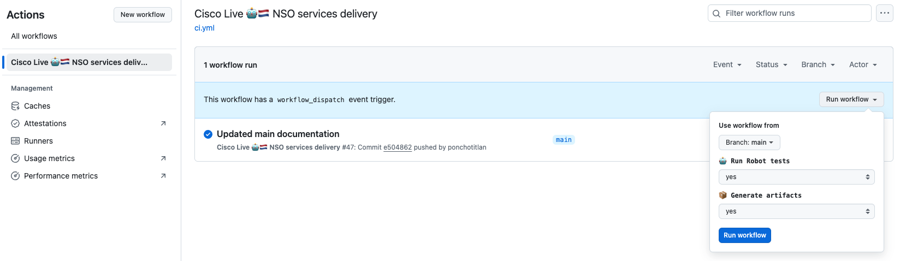

# 🤖 Swat Overflow 2.0 🤖
## ⚡️ Lessons Learned on CI Pipelines for NSO Services Development

This session will cover a collection of small tips and tricks for the development and delivery of **NSO services using CI pipelines**. These insights were gained through **hands-on experience** working with various customers and navigating the challenges and triumphs of establishing a reliable and meaningful CI process to ensure the quality of NSO packages. These pieces of advice are small in scope, but together they make a lot of sense - and might even be the push needed for any future project.

>  This collection of techniques was collected from real projects which take CI design for NSO services development very seriously.
Nevetheless, this does not intend to be a one-size-fits-all recommendations list. Each project has different scopes, infrastructure, tools available, budget, etc.

## 📚 Summary

In this fireside chat, we will briefly discuss the following topics:

- 🤖 Job definition using bash scripting
- 🔖 Features definition in yaml files
- 📃 ```docker-compose``` for NSO and other resources management
- 🔥 Job halting with meaninful checks
- 📦 Artifact packaging
- 🔀 Dynamic parameters on each run

## 🤖 Job definition using bash scripting

Definition of the entire CI pipeline with ```make``` commands that trigger small bash scripts.

* 👉🏽 [Our CI pipeline definition](https://github.com/ponchotitlan/embracing-devops-nso-usecase-lifecycle/blob/main/.github/workflows/ci.yml)
* 👉🏽 [Our Makefile](https://github.com/ponchotitlan/embracing-devops-nso-usecase-lifecycle/blob/main/Makefile)
* 👉🏽 [Our bash scripts collection](https://github.com/ponchotitlan/embracing-devops-nso-usecase-lifecycle/tree/main/pipeline/scripts)

👍🏽 Pros
- Your CI pipeline is more portable and can run on almost any standard system without additional configuration
- Bash is almost universally available on UNIX-like systems (Linux, macOS, etc.), which are commonly used for CI/CD environments
- Bash is inherently designed for running shell commands, which are often the backbone of CI pipelines
- Bash scripts are lightweight and have minimal overhead compared to Python
- It's easy to pass variables between steps or jobs, and to handle dynamic configurations

👎🏽 Cons
- Learning curve: More and more programmers are familiar with Python than with bash scripting
- If the logic becomes complex (e.g., conditionals, loops, or error handling), it can be tricky to make it work with bash syntax
- Robust error handling might become complicated with pure bash

## 🔖 Features definition in yaml files

Usage of yaml files for specifying the different parameters of our staging enrionment.

* 👉🏽 [Our config yaml](https://github.com/ponchotitlan/embracing-devops-nso-usecase-lifecycle/blob/main/pipeline/setup/config.yaml)

Sections:

- 🐋 NSO Docker container settings
- 📦 Binary files to download (could be the NEDs to use, services from Artifactory external to our repository, etc)
- 🤖 Netsims to spin

## 📃 ```docker-compose``` for NSO and other resources management

Usage of a template for creating docker-compose based environments which are handled independently on every run.

* 👉🏽 [Our docker-compose template](https://github.com/ponchotitlan/embracing-devops-nso-usecase-lifecycle/blob/main/pipeline/setup/docker-compose.j2)

Service contents:

- 🐋 The name of the service and the container itself follows this format: ```{{nso.container_name from yaml}}-{{git branch}}-{{git branch build no.}}```
- 🌄 Image to use
- 💾 Volumes to bind:
    - Packages in this repository
    - ```ncs.conf``` for the NSO Docker container
    - Pre-configuration files (auth groups, netsim devices configs, etc)
- 🌎 Environment variables for the NSO Docker container:
    - Do packages reload on every restart
    - Admin credentials
- 🏥 Healthchecks to know when is the container ready (```ncs_cmd command responsive```)

## 🔥 Job halting with meaninful checks

The CI stages actually stop whenever something is wrong, saving time in uneccesary execution of further stages. The bash scripts return a custom status tracked by the commands of our Makefile.

* 👉🏽 [Our Makefile](https://github.com/ponchotitlan/embracing-devops-nso-usecase-lifecycle/blob/main/Makefile)

Ex. 
```packages-reload.sh```

```
TOKEN_FAILED="result false"

reload_output=$(docker exec -i $container_name bash -lc "echo 'packages reload' | ncs_cli -Cu admin")
if echo "$reload_output" | grep -q "$TOKEN_FAILED"; then
    # Packages reload failed!
    echo "failed"
else
    # Packages reload passed!
    echo "pass"
fi
```

```Makefile```
```
load-packages:
	@pipeline/scripts/compile-packages.sh
	status=$$(pipeline/scripts/packages-reload.sh); \
	if [ "$$status" = "failed" ]; then \
		echo "📦❌ Service Packages loading failed!"; \
		exit 1; \
	else \
		echo "📦✅ Service Packages loading successful!"; \
	fi
```

## 📦 Artifact packaging

The release stages should create a compressed file with the compiled services of my repository. The compiling is happening anyhow as part of the staging environment setup, hence all dependencies and compilation order should be sorted by then.

Having an artifact of this kind helps with the following:

- 🔌 All dependencies between services are already sorted out
- ✅ All services contained in the artifact correspond to a valid release version
- 📦 Deployment of all-or-nothing in the customer environment

* 👉🏽 [A CI run with generated artifacts](https://github.com/ponchotitlan/embracing-devops-nso-usecase-lifecycle/actions/runs/15414224803)

## 🔀 Dynamic parameters on each run

For ease of development/testing, the pipeline is flexible on running tests Y/N and creating artifacts Y/N

* 👉🏽 [Our CI pipeline definition](https://github.com/ponchotitlan/embracing-devops-nso-usecase-lifecycle/blob/main/.github/workflows/ci.yml)



----------